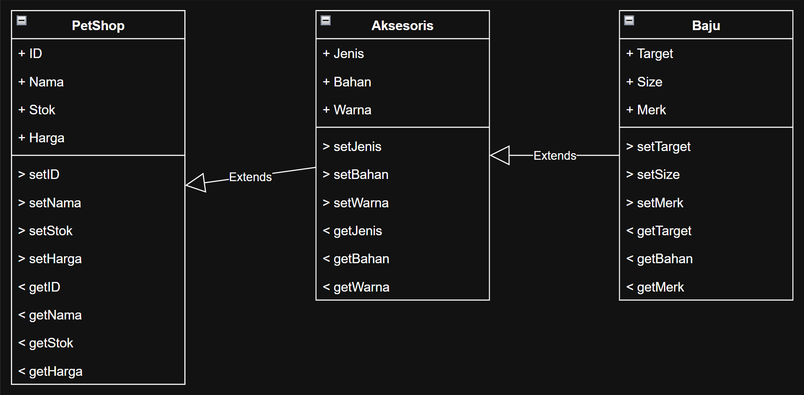
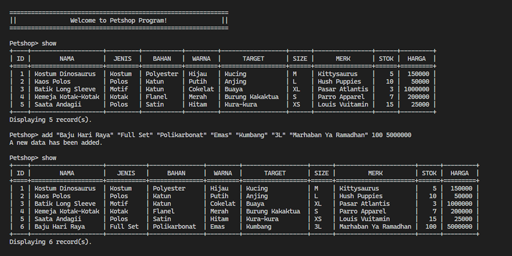
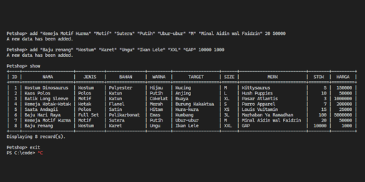
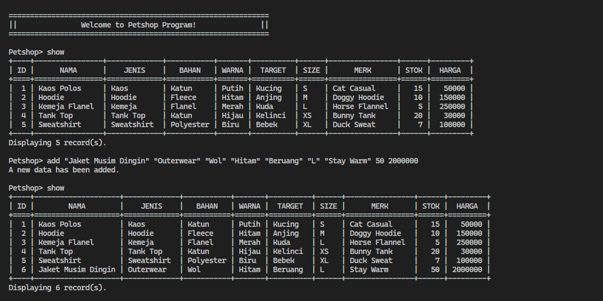
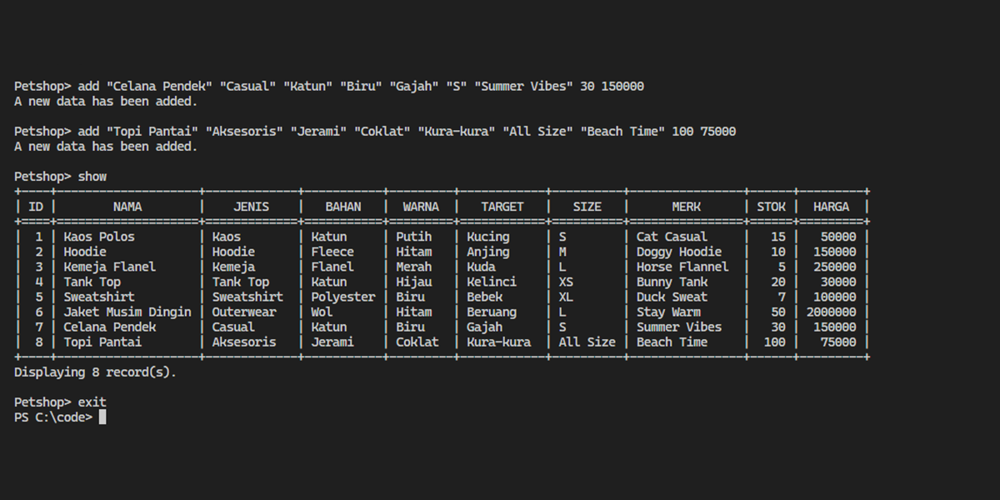
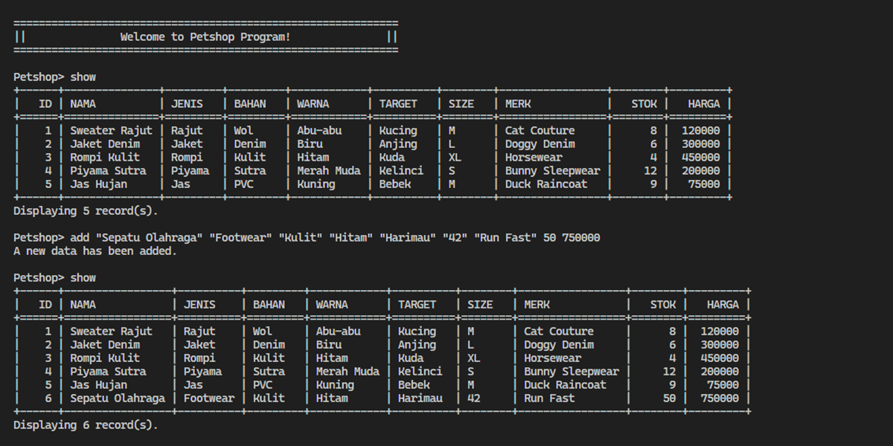
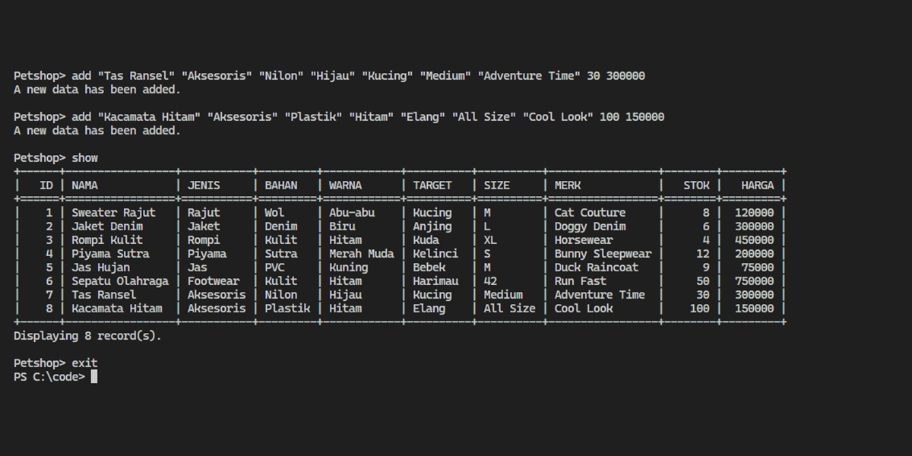

# Janji
_Saya Datuk Daneswara Raditya Samsura dengan NIM 2308224 mengerjakan Tugas Praktikum 1 pada Mata Kuliah Desain dan Pemrograman Berorientasi Objek (DPBO) untuk keberkahan-Nya maka saya tidak melakukan kecurangan seperti yang telah dispesifikasikan. Aamiin_

# Diagram

# Desain
Program terdiri dari __3__ class, yaitu __PetShop__, __Aksesoris__, dan __Baju__. Program menggunakan Multilevel Inheritance, dengan __PetShop__ sebagai class induk, dilanjutkan dengan __Aksesoris__, dan __Baju__ sebagai class paling bawah. Urutan inheritance ini dibuat karena class PetShop memiliki atribut paling general di antara ketiganya dan class Baju yang memiliki atribut paling spesifik pula. Berikut masing-masing atribut class:
- PetShop:
  - ID
  - Nama
  - Stok
  - Harga
  - Foto (khusus PHP)
- Aksesoris
  - Jenis
  - Bahan
  - Warna
- Baju
  - Target
  - Size
  - Merk

# Dokumentasi & Penjelasan
Untuk alur dalam __C++__, __Java__, dan __Python__, Setelah program dijalankan, user dapat memilih satu dari tiga opsi command:
- `ADD` untuk menambahkan data baru (ADD "\<Nama\>" "\<Jenis\>" "\<Bahan\>" "\<Warna\>" "\<Target\>" "\<Size\>" "\<Merk\>" \<Stok\> \<Harga\>),
- `SHOW` untuk menunjukkan semua data yang ada, dan
- `EXIT` untuk keluar atau mengakhiri program.

Catatan:
- ID pada program __auto increment__ atau akan otomatis di-set,
- Opsi command bersifat __case-insensitive__, yaitu tetap dapat dioperasikan walaupun command adalah `add`, `aDd`, `SHow`, dan lain lain,
- Jika command yang dimasukkan di luar dari pilihan, program akan menampilkan pesan "__Command not found!__",
- Program akan menerima input hingga command `EXIT`.

## C++

    
    

## JAVA

    
    

## PYTHON

    
    

## PHP
Untuk alur dalam __PHP__, program akan ditampilkan pada laman web seperti localhost dengan tampilan:
- Header dengan judul dan toggle buttons,
- List gambar yang dapat digunakan dengan klik toggle button,
- Tampilan tabel dengan kolom berisi atribut dari class,
- Tampilan CLI untuk wadah command yang dapat dimasukkan user dengan klik toggle button,

User dapat melakukan command `ADD` untuk menambahkan data baru (ADD "\<Nama\>" "\<Jenis\>" "\<Bahan\>" "\<Warna\>" "\<Target\>" "\<Size\>" "\<Merk\>" \<Stok\> \<Harga\> "\<Foto\>").

Catatan:
- ID pada program __auto increment__ atau akan otomatis di-set,
- Opsi command bersifat __case-insensitive__, yaitu tetap dapat dioperasikan walaupun command adalah `add`, `aDd`, `adD`, dan lain lain,
- Jika command yang dimasukkan di luar dari pilihan, program akan menampilkan pesan "__Command not found!__",
- Command `SHOW` akan otomatis dijalankan (tabel akan di-refresh) setelah setiap command lain dijalankan,
- Foto hanya bisa menggunakan asset yang ada pada __list gambar__,
- Gambar hanya dapat diubah, ditambahkan, dan dihapus __di luar dari program__.

https://github.com/user-attachments/assets/80ae92d8-0da0-47c3-b22a-0e8a495341a7
